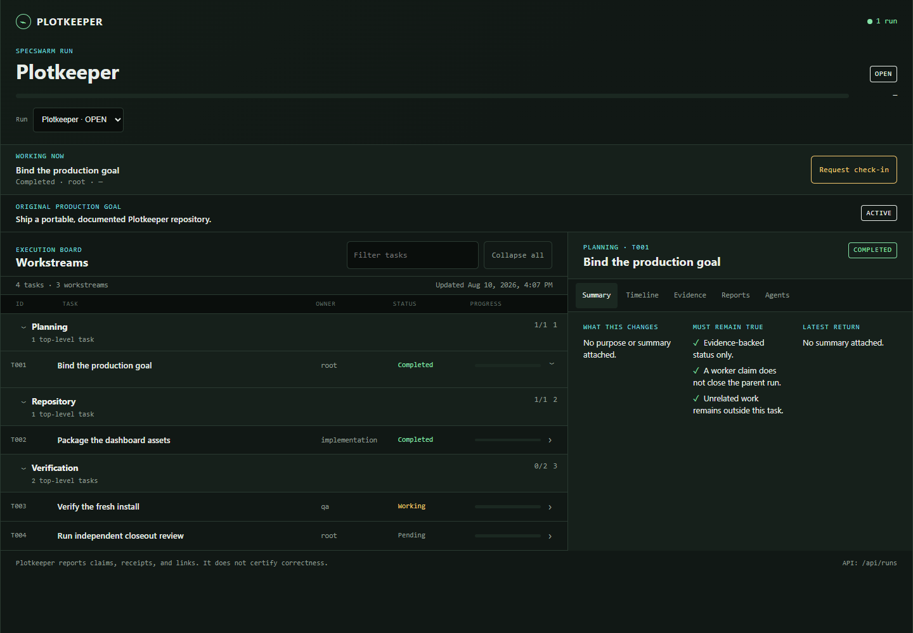
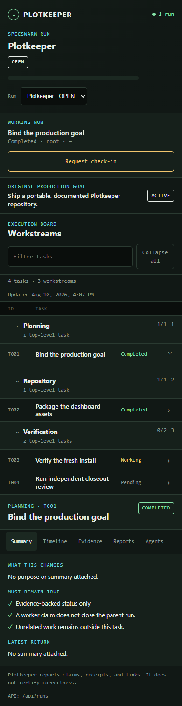

# Plotkeeper

Plotkeeper is a local, read-only run ledger and dashboard for Codex SpecSwarm.
It watches newly written Codex session events, connects root and child agents,
shows tasks, claims, evidence, and goal-contract context, and refuses to call a
run closed until the independent review gate reports `PASS` with zero open
items.



<details>
<summary>Mobile dashboard</summary>



</details>

## Why Plotkeeper

Long agent runs are difficult to inspect from one chat window. Plotkeeper gives
the human operator a local control surface without becoming another writer of
session truth:

- enrolls only new root sessions that invoke `$specswarm`;
- tails session JSONL by byte watermark and never edits those files;
- attaches child sessions and explicitly marked independent sessions;
- displays the active production goal, invariant set, task board, reports, and
  evidence links;
- injects the required closeout review after the root requests completion;
- closes only on `verdict=PASS open_items=0` from that injected review.

## Requirements

- Windows 10 or 11
- Python 3.11 or newer
- Codex sessions stored under `%USERPROFILE%\.codex\sessions` (configurable)
- Codex CLI on `PATH` for automatic check-in and review injection

Plotkeeper has no third-party runtime Python or browser dependencies.

## Install and run

Clone or download the repository, open PowerShell in its root, then run:

```powershell
.\scripts\install.ps1
```

The installer creates an isolated `.venv`, installs Plotkeeper into it, starts
the local service, and registers it for the current Windows user at sign-in.
Open <http://127.0.0.1:47831/>.

For an evaluation that does not touch your Codex sessions:

```powershell
py -3 -m venv .venv
.\.venv\Scripts\python -m pip install -e .
.\.venv\Scripts\python examples\demo.py --serve --open
```

The populated demo runs at <http://127.0.0.1:47832/>.

## Use with SpecSwarm

1. Start Plotkeeper before beginning a new SpecSwarm run.
2. Invoke `$specswarm` in the root Codex task. Plotkeeper enrolls that new root
   session; historical sessions are intentionally ignored.
3. Put the displayed `Plotkeeper-Run-ID` in locked artifacts and any independent
   task that must attach to the run.
4. Sync the approved checklist and goal contract:

   ```powershell
   .\scripts\pk.ps1 sync-plan --run-id <RUN_ID> `
     --file .\path\to\CHECKLIST.md `
     --contract .\runtime\goal-contracts\<CONTRACT>.json
   ```

5. Agents report claims or evidence through the CLI or session markers. When
   the root emits `PK:GOAL_COMPLETE_REQUEST` and completes its turn, Plotkeeper
   injects `$production-goal-review`.
6. Plotkeeper closes the run only after the injected task emits:

   ```text
   PK:REVIEW_RESULT run_id=<RUN_ID> verdict=PASS open_items=0
   ```

See [Integration](docs/INTEGRATION.md) for the complete marker contract and
[Usage](docs/USAGE.md) for every command.

## Documentation

- [Installation and configuration](docs/INSTALLATION.md)
- [Usage and CLI reference](docs/USAGE.md)
- [SpecSwarm integration](docs/INTEGRATION.md)
- [Architecture and trust boundaries](docs/ARCHITECTURE.md)
- [Troubleshooting](docs/TROUBLESHOOTING.md)
- [Examples](examples/README.md)
- [Contributing](docs/CONTRIBUTING.md)
- [Security](docs/SECURITY.md)

## Current scope

Plotkeeper is Windows-first and local-only. It binds to loopback by default,
uses SQLite for its derived ledger, and expects Codex's local JSONL session
format. It is not a remote collaboration server, a replacement for Git or CI,
or authority to bypass the production goal contract.

## License

No license has been selected yet. Until the repository owner adds one, normal
copyright restrictions apply.
